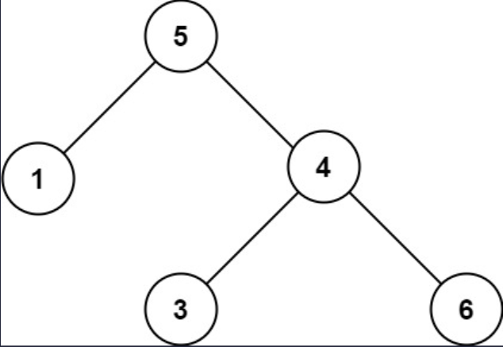

## 一、题目描述
给你一个二叉树的根节点`root`，判断其是否是一个有效的二叉搜索树。

**有效**二叉搜索树定义如下：
- 节点的左子树只包含**小于**当前节点的数。
- 节点的右子树只包含**大于**当前节点的数。
- 所有左子树和右子树自身必须也是二叉搜索树。

**示例 1**

输入: root = [2, 1, 3]
输出: true

**示例 2**

输入: root = [5, 1, 4, null, null, 3, 6]
输出: false
解释: 根节点的值是`5`，但是右子节点的值是`4`。

**提示**
- 树中节点数目范围在`[1, 10⁴]`内
- `-2³¹ <= Node.val <= 2³¹ - 1`

**相关主题**
- 树
- 深度优先搜索
- 二叉搜索树
- 二叉树


## 二、题解
::: code-tabs
@tab Rust节点定义
```rust
#[derive(Debug, PartialEq, Eq)]
pub struct TreeNode {
    pub val: i32,
    pub left: Option<Rc<RefCell<TreeNode>>>,
    pub right: Option<Rc<RefCell<TreeNode>>>,
}

impl TreeNode {
    #[inline]
    pub fn new(val: i32) -> Self {
        TreeNode {
            val,
            left: None,
            right: None,
        }
    }
}
```

@tab Java节点定义
```java
public class TreeNode {
    int val;
    TreeNode left;
    TreeNode right;

    TreeNode() {}
    TreeNode(int val) { this.val = val; }
    TreeNode(int val, TreeNode left, TreeNode right) {
        this.val = val;
        this.left = left;
        this.right = right;
    }
}
```
:::

### 方法 1: 夹逼定理
::: code-tabs
@tab Rust
```rust
pub fn is_valid_bst(root: Option<Rc<RefCell<TreeNode>>>) -> bool {
    //Self::dfs_recur_1(root)
    //Self::dfs_iter_1(root)
    Self::bfs_iter_1(root)
}

///
/// 深度优先搜索, 递归
///
fn dfs_recur_1(root: Option<Rc<RefCell<TreeNode>>>) -> bool {
    const DETERMINE: fn(Option<Rc<RefCell<TreeNode>>>, i64, i64) -> bool =
        |root, min, max| match root {
            None => true,
            Some(curr) => {
                let curr_val = curr.borrow().val as i64;
                if !(min < curr_val && curr_val < max) {
                    return false;
                }

                let left = curr.borrow_mut().left.take();
                let right = curr.borrow_mut().right.take();

                DETERMINE(left, min, curr_val) && DETERMINE(right, curr_val, max)
            }
        };

    DETERMINE(root, i64::MIN, i64::MAX)
}

///
/// 深度优先搜索, 迭代
///
fn dfs_iter_1(root: Option<Rc<RefCell<TreeNode>>>) -> bool {
    if let Some(root) = root {
        let mut stack = vec![(root, i64::MIN, i64::MAX)];

        while let Some((curr, min, max)) = stack.pop() {
            let curr_val = curr.borrow().val as i64;
            if !(min < curr_val && curr_val < max) {
                return false;
            }

            if let Some(right) = curr.borrow_mut().right.take() {
                stack.push((right, curr_val, max));
            }
            if let Some(left) = curr.borrow_mut().left.take() {
                stack.push((left, min, curr_val));
            }
        }
    }

    true
}

///
/// 广度优先搜索, 迭代
///
fn bfs_iter_1(root: Option<Rc<RefCell<TreeNode>>>) -> bool {
    if let Some(root) = root {
        let mut queue = VecDeque::from([(root, i64::MIN, i64::MAX)]);

        while let Some((curr, min, max)) = queue.pop_front() {
            let curr_val = curr.borrow().val as i64;
            if !(min < curr_val && curr_val < max) {
                return false;
            }

            if let Some(left) = curr.borrow_mut().left.take() {
                queue.push_back((left, min, curr_val));
            }
            if let Some(right) = curr.borrow_mut().right.take() {
                queue.push_back((right, curr_val, max));
            }
        }
    }

    true
}
```

@tab Java
```java
public boolean isValidBST(TreeNode root) {
    //return this.dfsRecur1(root);
    //return this.dfsIter1(root);
    return this.bfsIter1(root);
}

@FunctionalInterface
interface TriPredicate<A, B, C> {
    boolean test(A a, B b, C c);
}

TriPredicate<TreeNode, Long, Long> determine1 = (root, min, max) -> {
    if (root == null) {
        return true;
    }

    long currVal = root.val;
    if (!(min < currVal && currVal < max)) {
        return false;
    }

    return this.determine1.test(root.left, min, currVal) && this.determine1.test(root.right, currVal, max);
};

/**
 * 深度优先搜索, 递归
 */
boolean dfsRecur1(TreeNode root) {
    return this.determine1.test(root, Long.MIN_VALUE, Long.MAX_VALUE);
}

/**
 * 深度优先搜索, 迭代
 */
boolean dfsIter1(TreeNode root) {
    if (root != null) {
        Deque<Object[]> stack = new ArrayDeque<>() {{
            this.push(new Object[]{root, Long.MIN_VALUE, Long.MAX_VALUE});
        }};

        while (!stack.isEmpty()) {
            Object[] objs = stack.pop();
            TreeNode curr = (TreeNode) objs[0];
            long min = (long) objs[1];
            long max = (long) objs[2];

            long currVal = curr.val;
            if (!(min < currVal && currVal < max)) {
                return false;
            }

            if (curr.right != null) {
                stack.push(new Object[]{curr.right, currVal, max});
            }
            if (curr.left != null) {
                stack.push(new Object[]{curr.left, min, currVal});
            }
        }
    }

    return true;
}

/**
 * 广度优先搜索, 迭代
 */ 
boolean bfsIter1(TreeNode root) {
    if (root != null) {
        Deque<Object[]> queue = new ArrayDeque<>() {{
            this.addLast(new Object[]{root, Long.MIN_VALUE, Long.MAX_VALUE});
        }};

        while (!queue.isEmpty()) {
            Object[] objs = queue.removeFirst();
            TreeNode curr = (TreeNode) objs[0];
            long min = (long) objs[1];
            long max = (long) objs[2];

            long currVal = curr.val;
            if (!(min < currVal && currVal < max)) {
                return false;
            }

            if (curr.left != null) {
                queue.addLast(new Object[]{curr.left, min, currVal});
            }
            if (curr.right != null) {
                queue.addLast(new Object[]{curr.right, currVal, max});
            }
        }
    }

    return true;
}
```
:::

### 方法 2: 中序遍历是有序的
::: code-tabs
@tab Rust
```rust
pub fn is_valid_bst(root: Option<Rc<RefCell<TreeNode>>>) -> bool {
    //Self::dfs_recur_2(root)
    Self::dfs_iter_2(root)
}

///
/// 深度优先搜索, 递归
///
fn dfs_recur_2(root: Option<Rc<RefCell<TreeNode>>>) -> bool {
    let mut vals = vec![];
    const DETERMINE: fn(Option<Rc<RefCell<TreeNode>>>, &mut Vec<i32>) -> bool =
        |root, vals| match root {
            None => true,
            Some(curr) => {
                if !DETERMINE(curr.borrow_mut().left.take(), vals) {
                    return false;
                }

                let curr_val = curr.borrow().val;
                if !vals.last().map_or(true, |&prev_val| curr_val > prev_val) {
                    return false;
                }
                vals.push(curr_val);

                DETERMINE(curr.borrow_mut().right.take(), vals)
            }
        };

    DETERMINE(root, &mut vals)
}

///
/// 深度优先搜索, 迭代
///
fn dfs_iter_2(root: Option<Rc<RefCell<TreeNode>>>) -> bool {
    if let Some(root) = root {
        let mut vals = vec![];
        let mut stack = vec![Ok(root)];

        while let Some(curr) = stack.pop() {
            match curr {
                Ok(node) => {
                    if let Some(right) = node.borrow_mut().right.take() {
                        stack.push(Ok(right));
                    }

                    stack.push(Err(node.borrow().val));

                    if let Some(left) = node.borrow_mut().left.take() {
                        stack.push(Ok(left));
                    }
                }
                Err(curr_val) => {
                    if !vals.last().map_or(true, |&prev_val| curr_val > prev_val) {
                        return false;
                    }

                    vals.push(curr_val);
                }
            }
        }
    }

    true
}
```

@tab Java
```java
public boolean isValidBST(TreeNode root) {
    //return this.dfsRecur2(root);
    return this.dfsIter2(root);
}

BiPredicate<TreeNode, List<Integer>> determine2 = (root, vals) -> {
    if (root == null) {
        return true;
    }

    if (!this.determine2.test(root.left, vals)) {
        return false;
    }

    int currVal = root.val;
    if (!vals.isEmpty() && currVal <= vals.getLast()) {
        return false;
    }
    vals.add(currVal);

    return this.determine2.test(root.right, vals);
};
/**
 * 深度优先搜索, 递归
 */
boolean dfsRecur2(TreeNode root) {
    List<Integer> vals = new ArrayList<>();

    return this.determine2.test(root, vals);
}

/**
 * 深度优先搜索, 迭代
 */
boolean dfsIter2(TreeNode root) {
    if (root != null) {
        List<Integer> vals = new ArrayList<>();
        Deque<Object> stack = new ArrayDeque<>() {{
            this.push(root);
        }};

        while (!stack.isEmpty()) {
            Object obj = stack.pop();
            switch (obj) {
                case TreeNode node -> {
                    if (node.right != null) {
                        stack.push(node.right);
                    }

                    stack.push(node.val);

                    if (node.left != null) {
                        stack.push(node.left);
                    }
                }
                case Integer currVal -> {
                    if (!vals.isEmpty() && currVal <= vals.getLast()) {
                        return false;
                    }

                    vals.add(currVal);
                }
                default -> throw new IllegalStateException("Unexpected value: " + obj);
            }
        }
    }

    return true;
}
```
:::