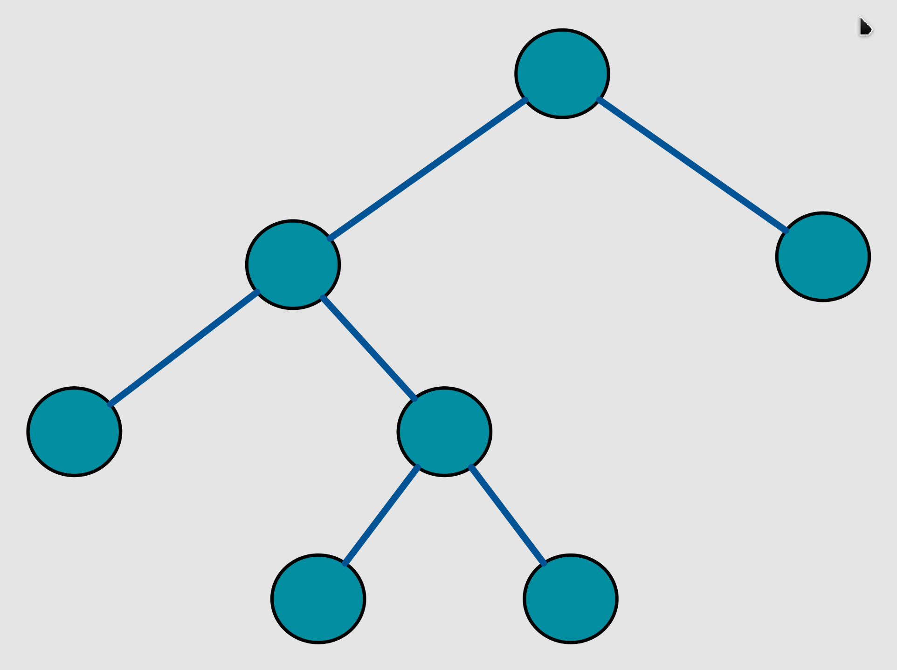
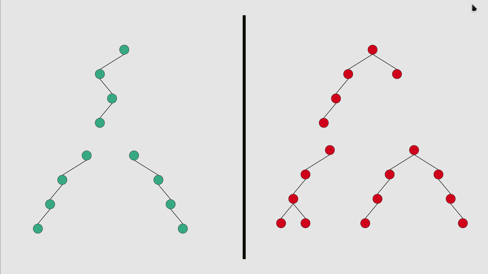
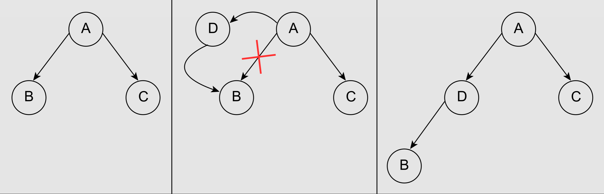
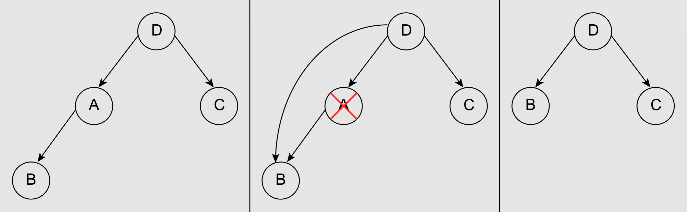
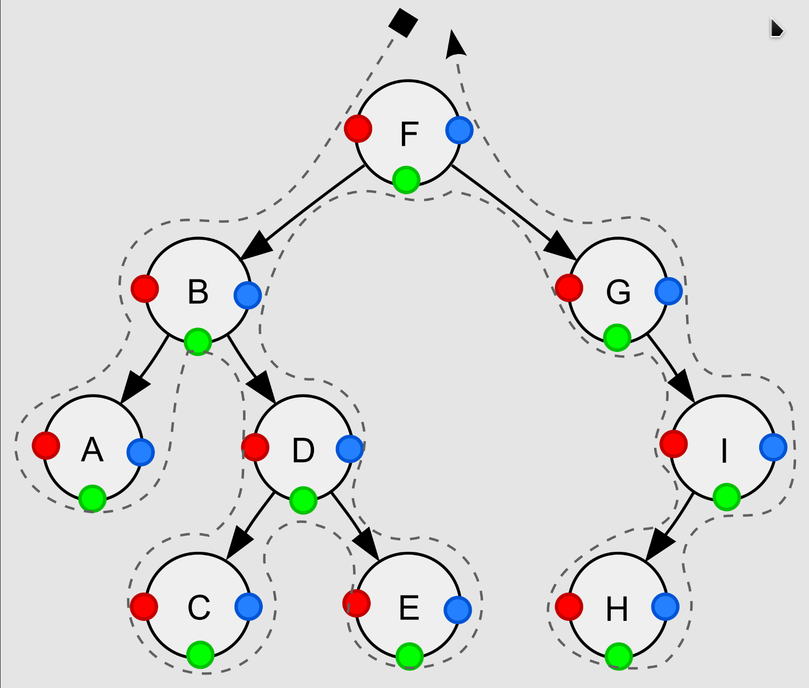
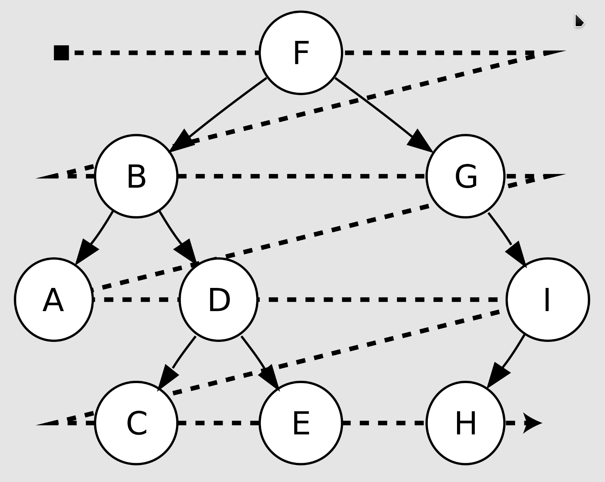

## 二叉树
### 定义
在计算机科学中，[**二叉树**][binary_tree]是每个节点最多只有两个分支（即不存在分支度大于2的节点）的树结构。通常分支被称作`左子树`或`右子树`。二叉树的分支具有左右次序，不能随意颠倒。


### 在图论中的定义
二叉树是一个连通的无环图，并且每一个顶点的度不大于3。有根二叉树还要满足根节点的度不大于2。有了根节点之后，每个顶点定义了唯一的父节点，和最多2个子节点。然而，没有足够的信息来区分左节点和右节点。如果不考虑连通性，允许图中有多个连通分量，这样的结构叫做森林。

### 二叉树的类型
1. 满二叉树：每个节点要么有0个孩子节点要么有2个孩子节点的二叉树，称为**满二叉树**。


2. 完美二叉树：一棵深度为`k`，且有`2^k − 1`个节点的二叉树，称为**完美二叉树**。这种树的特点是每一层上的节点数都是最大节点数。


3. 完全二叉树：在一颗二叉树中，若除最后一层外的其余层都是满的，并且最后一层要么是满的，要么在右边缺少连续若干节点，则此二叉树为**完全二叉树**。


4. 平衡二叉树：每个节点的左右两子树高度差都不超过1的**平衡二叉树**，常见的平衡二叉树如AVL树、红黑树等。


5. 退化二叉树：许多节点只有1个孩子节点，其行为表现更像是单链表的二叉树。


### 二叉树的性质
- 对于高度为`h`的满二叉树，其节点总数`n`和`h`的关系为`2h + 1 <= n <= 2^(h+1) - 1`。根节点的高度为0。对于一颗完美二叉树，其节点总数为`1 + 2 + 4 + … + 2^ℎ = 2^(ℎ+1) − 1`。

- 对于有`n`个节点的完美二叉树，其叶子节点个数为`l = (n + 1) / 2`。

- 对于任意一颗非空二叉树，其叶子节点个数`l`与度为2的内部节点个数`i2`的关系为`l = i2 + 1`。

- 对于有`n`个节点的二叉树，其最小的树高为`ℎ = log2(n + 1) − 1`，此时二叉树表现为完全二叉树。

- 对于有`l`个叶子节点的二叉树，其高度至少是`ℎ = log2(l)`。

- 对于一颗节点总数为`n`、边总数为`e`的非空二叉树，则节点总数与边的关系为`e = n - 1`。

- 对于一颗节点总数为`n`的二叉树，其缺失的孩子节点总数为`n + 1`。

- 对于有`n`个节点的完全二叉树，其内部节点的个数为`⌊n/2⌋`。

### 二叉树的操作
#### 插入
- 叶子节点
- 内部节点


#### 删除
- 无孩子节点或有1个孩子节点的节点
- 有2个孩子节点的节点


#### 遍历
##### 深度优先遍历（DFS）

- 前序遍历(根左右), 红色●表示其访问顺序: F, B, A, D, C, E, G, I, H
::: code-tabs
@tab 递归实现
```text
procedure pre_order(node)
    if node = null
        return
    visit(node)
    pre_order(node.left)
    pre_order(node.right)
```

@tab 迭代实现
```text
procedure pre_order(node)
    if node = null
        return
    stack ← empty stack
    stack.push(node)
    while not stack.isEmpty()
        node ← stack.pop()
        visit(node)
        // right child is pushed first so that left is processed first
        if node.right ≠ null
            stack.push(node.right)
        if node.left ≠ null
            stack.push(node.left)
```
:::

- 中序遍历(左根右), 绿色●表示其访问顺序: A, B, C, D, E, F, G, H, I
::: code-tabs
@tab 递归实现
```text
procedure in_order(node)
    if node = null
        return
    in_order(node.left)
    visit(node)
    in_order(node.right)
```

@tab 迭代实现
```text
procedure in_order(node)
    stack ← empty stack
    while not stack.isEmpty() or node ≠ null
        if node ≠ null
            stack.push(node)
            node ← node.left
        else
            node ← stack.pop()
            visit(node)
            node ← node.right
```
:::

- 后序遍历(左右根), 蓝色●表示其访问顺序: A, C, E, D, B, H, I, G, F
::: code-tabs
@tab 递归实现
```text
procedure post_order(node)
    if node = null
        return
    post_order(node.left)
    post_order(node.right)
    visit(node)
```

@tab 迭代实现
```text
procedure post_order(node)
    stack ← empty stack
    lastNodeVisited ← null
    while not stack.isEmpty() or node ≠ null
        if node ≠ null
            stack.push(node)
            node ← node.left
        else
            peekNode ← stack.peek()
            // if right child exists and traversing node
            // from left child, then move right
            if peekNode.right ≠ null and lastNodeVisited ≠ peekNode.right
                node ← peekNode.right
            else
                visit(peekNode)
                lastNodeVisited ← stack.pop()
```
:::

##### 广度优先遍历（BFS）

- 层序遍历: F, B, G, A, D, I, C, E, H
::: code-tabs
@tab 迭代实现
```text
procedure level_order(node)
    queue ← empty queue
    queue.enqueue(node)
    while not queue.isEmpty()
        node ← queue.dequeue()
        visit(node)
        if node.left ≠ null
            queue.enqueue(node.left)
        if node.right ≠ null
            queue.enqueue(node.right)
```
:::


## 习题
### 二叉树的遍历方式
[144: 二叉树的前序遍历]
[145: 二叉树的后序遍历]
[94: 二叉树的中序遍历]
[102: 二叉树的层序遍历]

### 二叉树的属性
[101: 对称二叉树]
[104: 二叉树的最大深度]
[111: 二叉树的最小深度]
[222: 完全二叉树的节点个数]
[110: 平衡二叉树]
[257: 二叉树的所有路径]
[404: 左叶子之和]
[513: 找树左下角的值]
[112: 路径总和]

### 二叉树的修改与构造
[226: 翻转二叉树]
[105: 从中序与先序遍历序列构造二叉树]
[106: 从中序与后序遍历序列构造二叉树]
[654: 最大二叉树]
[617: 合并二叉树]

### 二叉搜索树的属性
[700: 二叉搜索树中的搜索]
[98: 验证二叉搜索树]
[530: 二叉搜索树的最小绝对差]
[501: 二叉搜索树中的众数]
[538: 把二叉搜索树转换为累加树]

### 二叉树公共祖先问题
[236: 二叉树的最近公共祖先]
[235: 二叉搜索树的最近公共祖先]

### 二叉搜索树的修改与构造
[701: 二叉搜索树中的插入操作]
[450: 删除二叉搜索树中的节点]
[669: 修剪二叉搜索树]
[108: 将有序数组转换为二叉搜索树]
[109: 将有序列表转换为二叉搜索树]


## 总结


[binary_tree]: https://zh.wikipedia.org/wiki/%E4%BA%8C%E5%8F%89%E6%A0%91