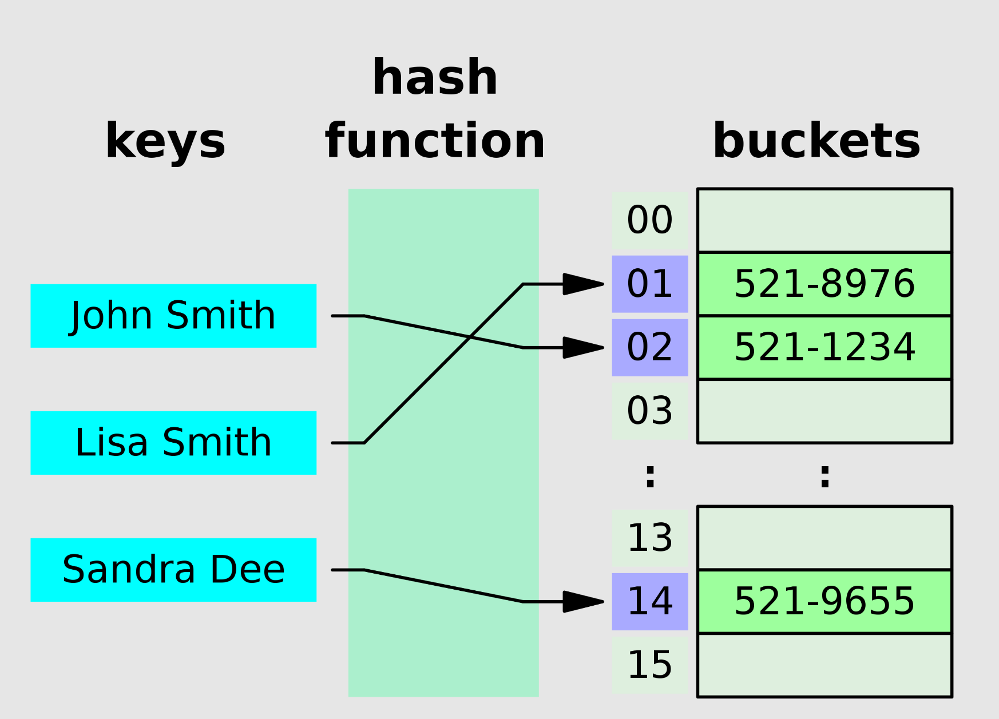
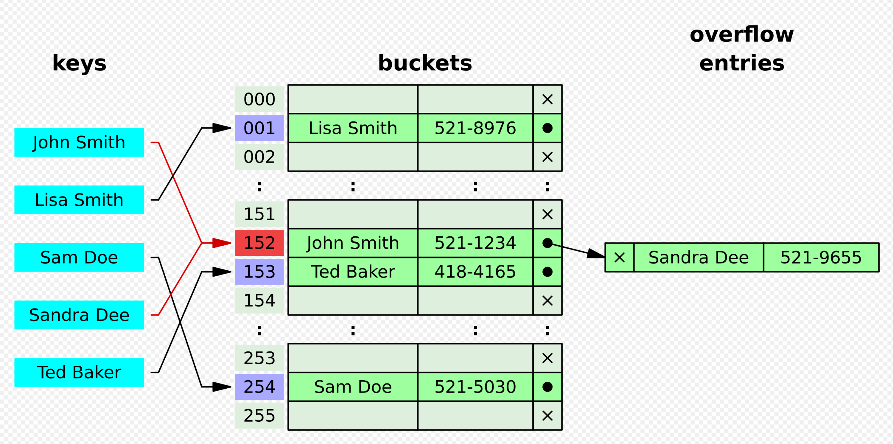
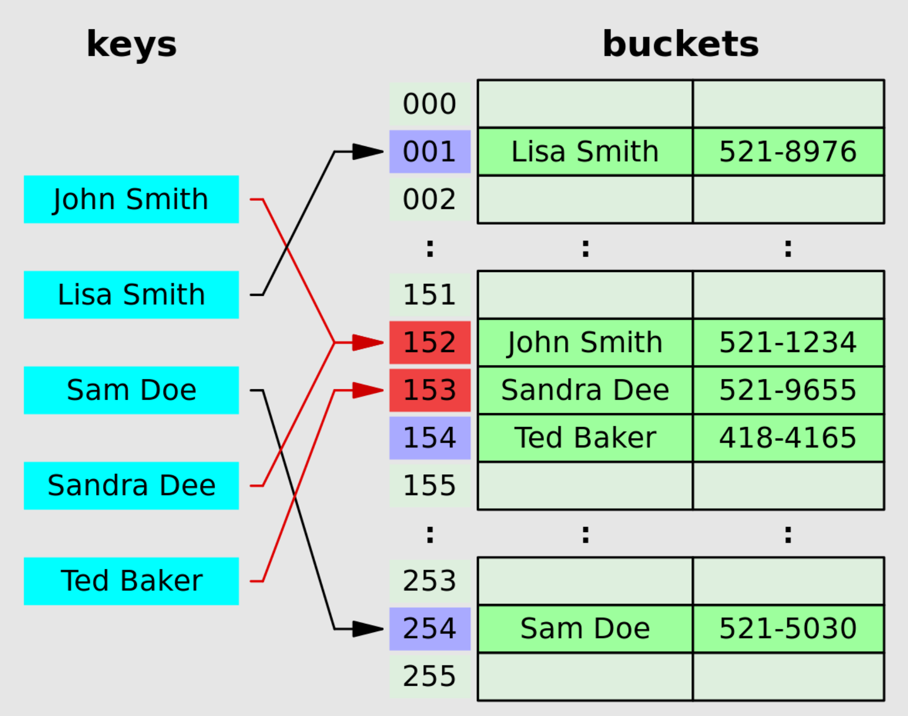
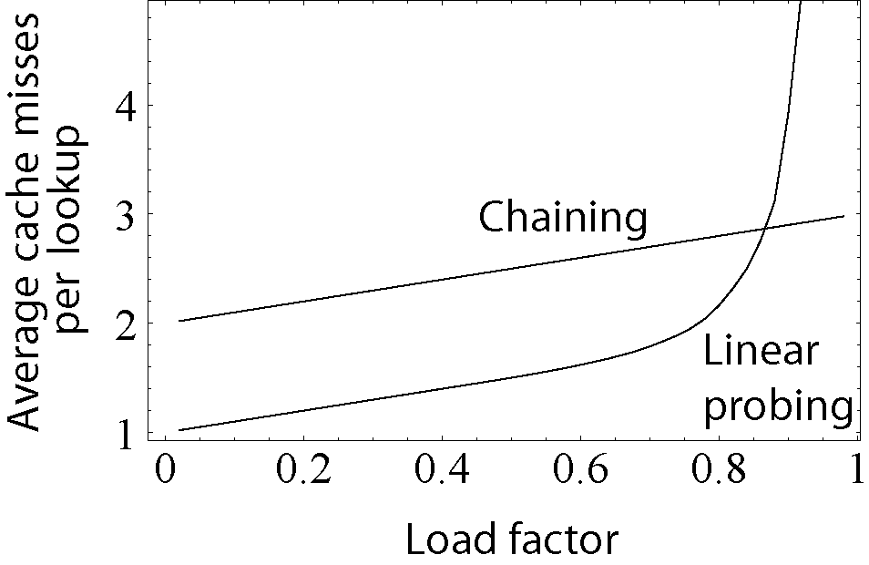

## 哈希表的理论知识
### 概念
散列表（Hash table，也叫哈希表），是根据键（Key）而直接访问在内存储存位置的数据结构。也就是说，它通过计算出一个键值的函数，将所需查询的数据映射到表中一个位置来让人访问，这加快了查找速度。这个映射函数称做**散列函数**，存放记录的数组称做**散列表**。

### 哈希函数
若关键字为`k`，则其值存放在`f(k)`的存储位置上。由此，不需比较便可直接取得所查记录。称这个对应关系`f`为散列函数。

对不同的关键字可能得到同一散列地址，即`k1 != k2`，而`f(k1) = f(k2)`，这种现象称为**冲突**（Collision）。

### 处理冲突
#### 1. 分离连接法

#### 2. 开放定址法

- ***线性探测***: 逐个探测存放地址的表，直到查找到一个空单元，把散列地址存放在该空单元。

- ***平方探测***
- ***二次哈希***

### 载荷因子
散列表的载荷因子定义为：a = 填入表中的元素个数 / 散列表的长度

a是散列表装满程度的标志因子。由于表长是定值，a与"填入表中的元素个数"成正比，所以，a越大，表明填入表中的元素越多，产生冲突的可能性就越大；反之，a越小，表明填入表中的元素越少，产生冲突的可能性就越小。

对于开放定址法，荷载因子是特别重要因素，应严格限制在0.7-0.8以下。

## 习题
### 有效的字母异位词
[242: 有效的字母异位词](242_valid_anagram.md)
[383: 赎金信](383_Ransom%20Note.md)
[49: 字母异位词分组]
[438: 找到字符串中所有字母异位词]

### 两个数组的交集
[349: 两个数组的交集]
[350: 两个数组的交集II]

### 快乐数
[202: 快乐数]

### 两数之和
[1: 两数之和]

### 三数之和
[15: 三数之和]
[16: 最接近的三数之和]

### 四数之和
[18: 四数之和]
[454: 四数之和II]

## 总结
