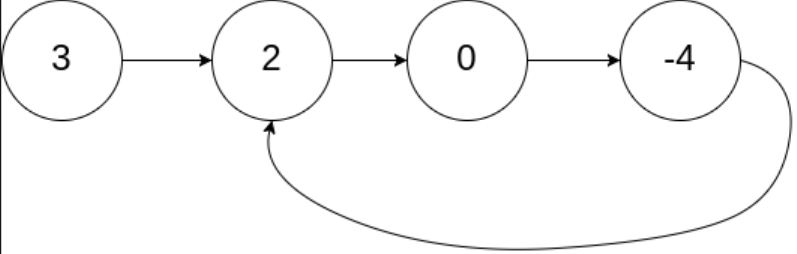
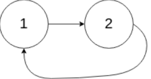
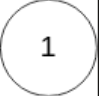

## 一、题目描述
给你一个链表的头节点`head`，判断链表中是否有环。

如果链表中有某个节点，可以通过连续跟踪`next`指针再次到达，则链表中存在环。
为了表示给定链表中的环，评测系统内部使用整数`pos`来表示链表尾连接到链表中的位置（索引从0开始）。
**注意：`pos`不作为参数进行传递**。仅仅是为了标识链表的实际情况。

如果*链表中存在环*，则返回`true`。否则返回`false`。

**示例 1**

输入: head = [3, 2, 0, -4], pos = 1
输出: true
解释: 链表中有一个环，其尾部连接到第二个节点。

**示例 2**

输入: head = [1, 2], pos = 0
输出: true
解释: 链表中有一个环，其尾部连接到第一个节点。

**示例 3**

输入: head = [1], pos = -1
输出: false
解释: 链表中没有环。

**提示**

- 链表中节点的数目范围是`[0, 10⁴]`
- `-10⁵ <= Node.val <= 10⁵`
- `pos`为`-1`或者链表中的一个**有效索引**。

**进阶**
你能用`O(1)`（即，常量）内存解决此问题吗？

**相关主题**

- 哈希表
- 链表
- 双指针

## 二、题解
::: code-tabs
@tab ListNode(Rust)
```rust
type NLink = *mut ListNode;

pub struct ListNode {
    pub val: i32,
    pub next: NLink,
}

impl ListNode {
    pub fn new(val: i32, next: NLink) -> NLink {
        Box::into_raw(Box::new(ListNode { val, next }))
    }
}
```

@tab ListNode(Java)
```java
public class ListNode {
    int val;
    ListNode next;
    public ListNode() {}
    public ListNode(int val) { this.val = val; }
    public ListNode(int val, ListNode next) { this.val = val; this.next = next; }
}
```
:::
### 方法 1: 使用哈希集合
::: code-tabs
@tab Rust
```rust
pub fn has_cycle(head: NLink) -> bool {
    let mut set = HashSet::new();

    while !node.is_null() {
        if set.contains(&node) {
            return true;
        }
        set.insert(node);
        unsafe {
            node = (*node).next;
        }
    }

    false
}
```

@tab Java
```java
public boolean hasCycle(ListNode head) {
    HashSet<ListNode> set = new HashSet<>();

    while (node != null) {
        if (set.contains(node)) {
            return true;
        }
        set.add(node);
        node = node.next;
    }

    return false;
}
```
:::

### 方法 2: 双指针
::: code-tabs
@tab Rust
```rust
pub fn has_cycle(head: NLink) -> bool {
    let mut slow = node;
    let mut fast = node;

    loop {
        unsafe {
            if fast.is_null() {
                break;
            }
            fast = (*fast).next;
            if fast.is_null() {
                break;
            }
            fast = (*fast).next;
            slow = (*slow).next;
            if slow == fast {
                break;
            }
        }
    }

    !fast.is_null()
}
```

@tab Java
```java
public boolean hasCycle(ListNode head) {
    ListNode slow = node;
    ListNode fast = node;

    do {
        if (fast == null) {
            break;
        }
        fast = fast.next;
        if (fast == null) {
            break;
        }
        fast = fast.next;
        slow = slow.next;
    } while (slow != fast);

    return fast != null;
}
```
:::