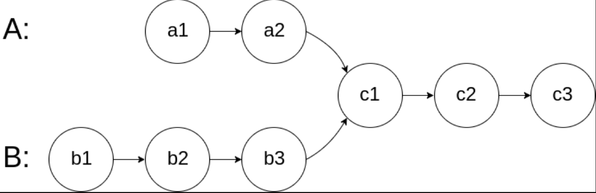
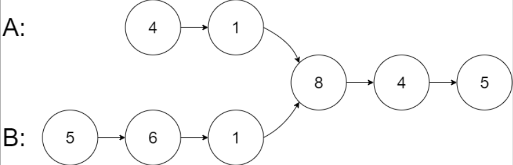

## 一、题目描述
给你两个单链表的头节点`headA`和`headB`，请你找出并返回两个单链表相交的起始节点。如果两个链表不存在相交节点，返回`null`。

图示两个链表在节点 c1 开始相交：

题目数据**保证**整个链式结构中不存在环。
**注意**，函数返回结果后，链表必须**保持其原始结构**。

**自定义评测:**
`评测系统`的输入如下（你设计的程序`不适用`此输入）：

- `intersectVal` - 相交的起始节点的值。如果不存在相交节点，这一值为`0`
- `listA` - 第一个链表
- `listB` - 第二个链表
- `skipA` - 在`listA`中（从头节点开始）跳到交叉节点的节点数
- `skipB` - 在`listB`中（从头节点开始）跳到交叉节点的节点数

评测系统将根据这些输入创建链式数据结构，并将两个头节点`headA`和`headB`传递给你的程序。如果程序能够正确返回相交节点，那么你的解决方案将被`视作正确答案`。

**示例 1**

输入: intersectVal = 8, listA = [4,1,8,4,5], listB = [5,6,1,8,4,5], skipA = 2, skipB = 3
输出: Intersected at '8'
解释: 相交节点的值为8（注意，如果两个链表相交则不能为0）。从各自的表头开始算起，链表A为[4, 1, 8, 4, 5]，链表B为[5, 6, 1, 8, 4, 5]。在A中，相交节点前有2个节点；在B中，相交节点前有3个节点。

— 请注意相交节点的值不为1，因为在链表A和链表B之中值为1的节点(A中第二个节点和B中第三个节点)是不同的节点。换句话说，它们在内存中指向两个不同的位置，而链表A和链表B中值为8的节点(A中第三个节点，B中第四个节点)在内存中指向相同的位置。

**示例 2**

输入: intersectVal = 2, listA = [1, 9, 1, 2, 4], listB = [3, 2, 4], skipA = 3, skipB = 1
输出: Intersected at '2'
解释: 相交节点的值为2（注意，如果两个链表相交则不能为0）。从各自的表头开始算起，链表A为[1, 9, 1, 2, 4]，链表B为[3, 2, 4]。在A中，相交节点前有3个节点；在B中，相交节点前有1个节点。

**示例 3**

输入: intersectVal = 0, listA = [2, 6, 4], listB = [1, 5], skipA = 3, skipB = 2
输出: null
解释: 从各自的表头开始算起，链表A为[2, 6, 4]，链表B为[1, 5]。由于这两个链表不相交，所以intersectVal必须为0，而skipA和skipB可以是任意值。这两个链表不相交，因此返回null。


**提示**

- `listA`中节点数目为`m`
- `listB`中节点数目为`n`
- `1 <= m, n <= 3 * 10⁴`
- `1 <= Node.val <= 10⁵`
- `0 <= skipA <= m`
- `0 <= skipB <= n`
- 如果`listA`和`listB`没有交点，`intersectVal`为`0`
- 如果`listA`和`listB`有交点，`intersectVal == listA[skipA] == listB[skipB]`

**进阶**
你能否设计一个时间复杂度`O(m + n)`、仅用`O(1)`内存的解决方案？

**相关主题**

- 哈希表
- 链表
- 双指针

## 二、题解
::: code-tabs
@tab ListNode(Rust)
```rust
type NLink = *mut ListNode;

pub struct ListNode {
    pub val: i32,
    pub next: NLink,
}

impl ListNode {
    pub fn new(val: i32, next: NLink) -> NLink {
        Box::into_raw(Box::new(ListNode { val, next }))
    }
}
```

@tab ListNode(Java)
```java
public class ListNode {
    int val;
    ListNode next;

    public ListNode() {}
    public ListNode(int val) { this.val = val; }
    public ListNode(int val, ListNode next) { this.val = val; this.next = next; }
}
```
:::

### Approach 1: 哈希集合
::: code-tabs
@tab Rust
```rust
pub fn get_intersection_node(head_a: NLink, head_b: NLink) -> NLink {
    if head_a.is_null() || head_b.is_null() {
        return null_mut();
    }

    let mut set = HashSet::new();
    while !head_a.is_null() {
        let temp = head_a;
        set.insert(temp);
        unsafe {
            head_a = (*head_a).next;
        }
    }
    while !head_b.is_null() {
        let temp = head_b;
        if set.contains(&temp) {
            return temp;
        }
        unsafe {
            head_b = (*head_b).next;
        }
    }

    null_mut()
}
```

@tab Java
```java
public ListNode getIntersectionNode(ListNode headA, ListNode headB) {
    if (headA == null || headB == null) {
        return null;
    }

    HashSet<ListNode> set = new HashSet<>();
    while (headA != null) {
        ListNode temp = headA;
        set.add(temp);
        headA = headA.next;
    }
    while (headB != null) {
        ListNode temp = headB;
        if (set.contains(temp)) {
            return temp;
        }
        headB = headB.next;
    }

    return null;
}
```
:::

### Approach 2: 双指针
::: code-tabs
@tab Rust
```rust
pub fn get_intersection_node(head_a: NLink, head_b: NLink) -> NLink {
    if head_a.is_null() || head_b.is_null() {
        return null_mut();
    }

    let mut ptr_a = head_a;
    let mut ptr_b = head_b;
    while ptr_a != ptr_b {
        unsafe {
            ptr_a = if ptr_a.is_null() {
                head_b
            } else {
                (*ptr_a).next
            };
            ptr_b = if ptr_b.is_null() {
                head_a
            } else {
                (*ptr_b).next
            };
        }
    }

    ptr_a
}
```

@tab Java
```java
public ListNode getIntersectionNode(ListNode headA, ListNode headB) {
    if (headA == null || headB == null) {
        return null;
    }

    ListNode ptrA = headA, ptrB = headB;
    while (ptrA != ptrB) {
        ptrA = ptrA == null ? headB : ptrA.next;
        ptrB = ptrB == null ? headA : ptrB.next;
    }
    
    return ptrA;
}
```
:::