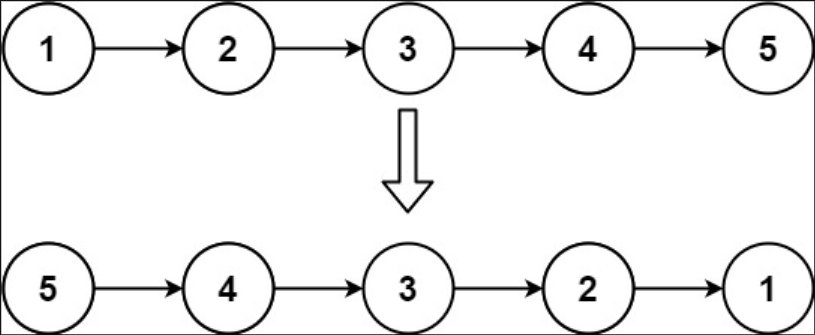
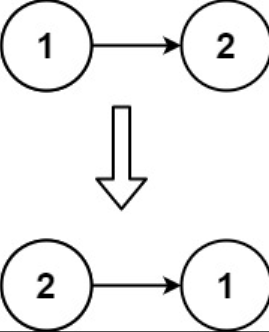

## 一、题目描述
给你单链表的头节点head，请你反转链表，并返回反转后的链表。

**示例 1**

输入: head = [1, 2, 3, 4, 5]
输出: [5, 4, 3, 2, 1]

**示例 2**

输入: head = [1, 2]
输出: [2, 1]

**示例 3**
输入: head = []
输出: []

**提示**

- 链表中节点的数目范围是 [0, 5000]
- -5000 <= Node.val <= 5000

**进阶**
链表可以选用迭代或递归方式完成反转。你能否用两种方法解决这道题？

**相关主题**

- 链表
- 递归

## 二、题解
### 方法 1: 迭代
::: code-tabs
@tab Rust
```rust
pub struct ListNode {
    pub val: i32,
    pub next: Option<Box<ListNode>>,
}

pub fn reverse_list(mut head: Option<Box<ListNode>>) -> Option<Box<ListNode>> {
    let mut new_head = None;

    while let Some(mut node) = head {
        head = node.next.take();
        node.next = new_head;
        new_head = Some(node);
    }

    new_head
}
```

@tab Java
```java
public class ListNode {
     int val;
     ListNode next;
}

public ListNode reverseList(ListNode head) {
    ListNode newHead = null;
    ListNode curr = null;

    while (head != null) {
        curr = head;
        head = head.next;
        curr.next = newHead;
        newHead = curr;
    }

    return newHead;
}
```
:::

### 方法 2: 递归
::: code-tabs
@tab Rust
```rust
pub struct ListNode {
    pub val: i32,
    pub next: Option<Box<ListNode>>,
}

pub fn reverse_list(head: Option<Box<ListNode>>) -> Option<Box<ListNode>> {
    const RECURSION_HELPER: fn(
        Option<Box<ListNode>>,
        Option<Box<ListNode>>,
    ) -> Option<Box<ListNode>> = |prev, curr| match curr {
        None => prev,
        Some(mut curr) => {
            let next = curr.next.take();
            curr.next = prev;
            RECURSION_HELPER(Some(curr), next)
        }
    };

    RECURSION_HELPER(None, head)
}
```

@tab Java
```java
public class ListNode {
     int val;
     ListNode next;
}

BiFunction<ListNode, ListNode, ListNode> recursionHelper = (prev, curr) -> {
    if (curr == null) {
        return prev;
    }

    ListNode next = curr.next;
    curr.next = prev;
    return this.recursionHelper.apply(curr, next);
};

public ListNode reverseList(ListNode head) {
    return recursionHelper.apply(null, head);
}
```
:::