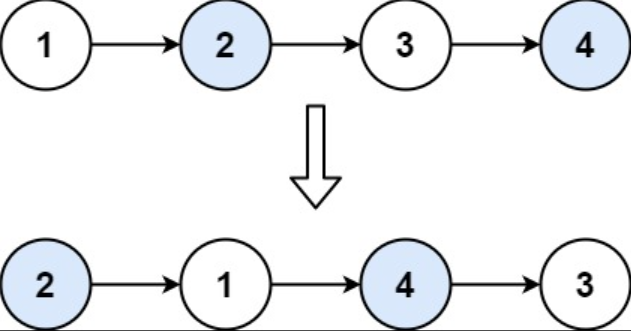

## 一、题目描述
给你一个链表，两两交换其中相邻的节点，并返回交换后链表的头节点。你必须在不修改节点内部的值的情况下完成本题（即：只能进行节点交换）。

**示例 1**

输入: head = [1, 2, 3, 4]
输出: [2, 1, 4, 3]

**示例 2**
输入: head = []
输出: []

**示例 3**
输入: head = [1]
输出: [1]

**提示**

- 链表中节点的数目在范围[0, 100]内
- 0 <= Node.val <= 100

**相关主题**

- 链表
- 递归

## 二、题解
### 方法 1: 迭代
::: code-tabs
@tab Rust
```rust
pub struct ListNode {
    pub val: i32,
    pub next: Option<Box<ListNode>>,
}

pub fn swap_pairs(head: Option<Box<ListNode>>) -> Option<Box<ListNode>> {
    let mut dummy = ListNode::new(-1);
    dummy.next = head;
    let mut p = &mut dummy;

    while let Some(mut curr) = p.next.take() {
        match curr.next.take() {
            None => {
                p.next = Some(curr);
                break;
            }
            Some(mut next) => {
                curr.next = next.next.take();
                next.next = Some(curr);
                p.next = Some(next);
                p = p.next.as_mut().unwrap().next.as_mut().unwrap();
            }
        }
    }

    dummy.next
}
```

@tab Java
```java
public class ListNode {
     int val;
     ListNode next;
}

public ListNode swapPairs(ListNode head) {
    ListNode dummy = new ListNode(-1, head);
    ListNode temp = dummy;

    while (temp.next != null) {
        ListNode curr = temp.next;
        ListNode next = curr.next;
        if (next == null) {
            break;
        }
        curr.next = next.next;
        next.next = curr;
        temp.next = next;
        temp = curr;
    }

    return dummy.next;
}
```
:::

### 方法 2: 递归
::: code-tabs
@tab Rust
```rust
pub struct ListNode {
    pub val: i32,
    pub next: Option<Box<ListNode>>,
}

pub fn swap_pairs(head: Option<Box<ListNode>>) -> Option<Box<ListNode>> {
    const RECURSION_HELPER: fn(Option<Box<ListNode>>) -> Option<Box<ListNode>> =
        |curr| match curr {
            None => None,
            Some(mut curr) => match curr.next.take() {
                None => Some(curr),
                Some(mut next) => {
                    curr.next = RECURSION_HELPER(next.next.take());
                    next.next = Some(curr);
                    Some(next)
                }
            },
        };

    RECURSION_HELPER(head)
}
```

@tab Java
```java
public class ListNode {
     int val;
     ListNode next;
}

Function<ListNode, ListNode> recursionHelper = (curr) -> {
    if (curr == null) {
        return null;
    }
    ListNode next = curr.next;
    if (next == null) {
        return curr;
    }
    curr.next = this.recursionHelper.apply(next.next);
    next.next = curr;
    return next;
};

public ListNode swapPairs(ListNode head) {
    return this.recursionHelper.apply(head);
}
```
:::