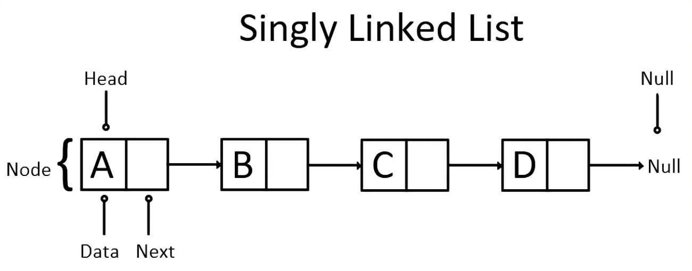
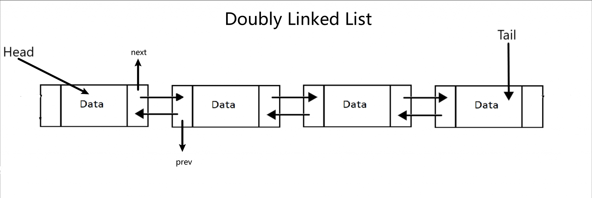
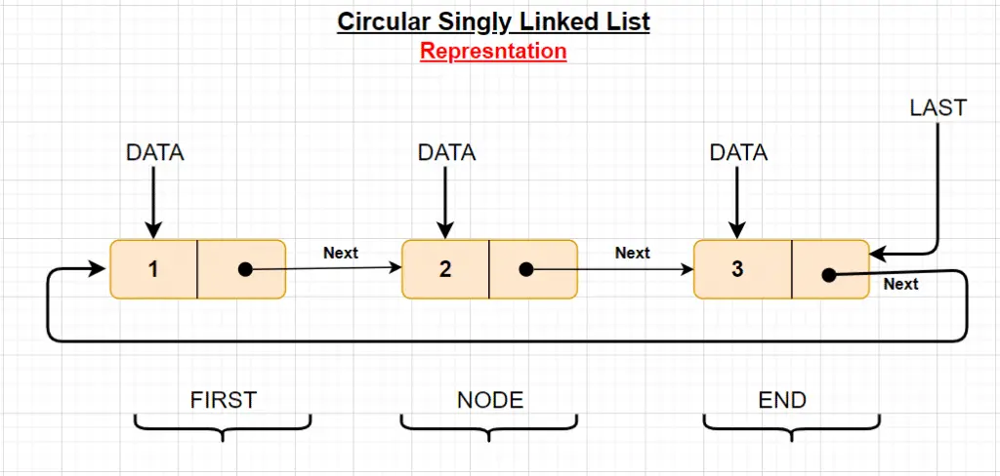
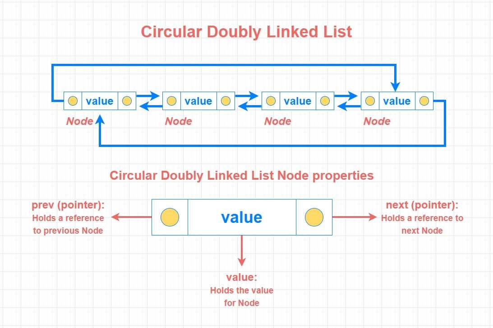
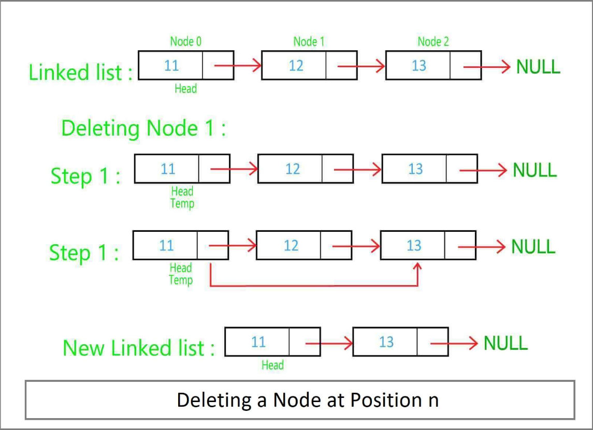
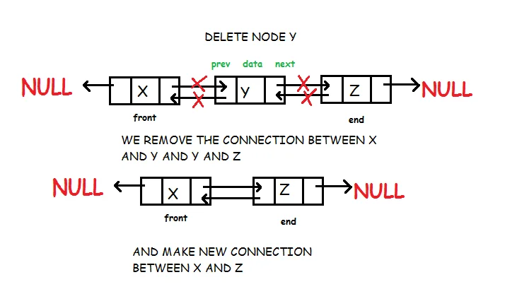

## 链表
链表是一种通过指针串联在一起的线性结构，每一个节点由两部分组成，一个是数据域，另一个是指针域。

### 链表的类型

- 单链表

- 双链表

- 循环单链表

- 循环双链表

### 链表的内存分配
链表中的节点在内存中不是连续分布的 ，而是散乱分布在内存中的某地址上。

### 链表的操作
#### 添加节点

#### 删除节点

## 习题
### 移除链表元素
[203: 移除链表元素](203_remove_linked_list_elements.md)

### 设计链表
[707: 设计链表](707_design_linked_list.md)

### 反转链表
[206: 反转链表](206_reverse_linked_list.md)

### 两两交换链表中的节点
[24: 两两交换链表中的节点]

### 删除链表的倒数第N个节点
[19: 删除链表的倒数第N个节点]

### 链表相交
[160: 链表相交]

### 环形链表
[141: 环形链表]
[142: 环形链表II]

## 总结