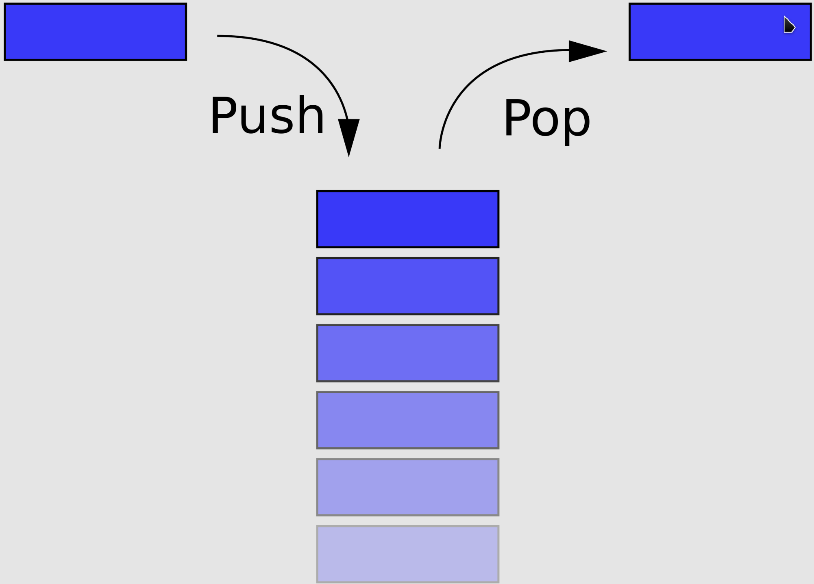
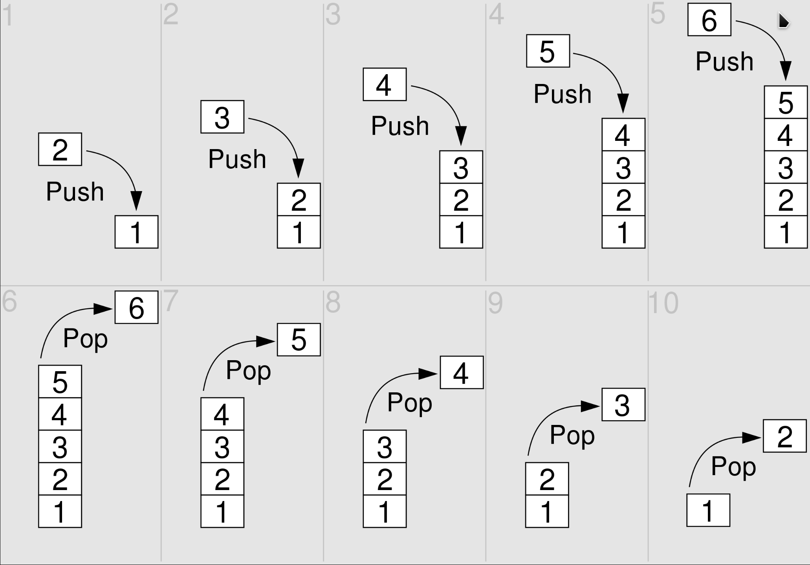
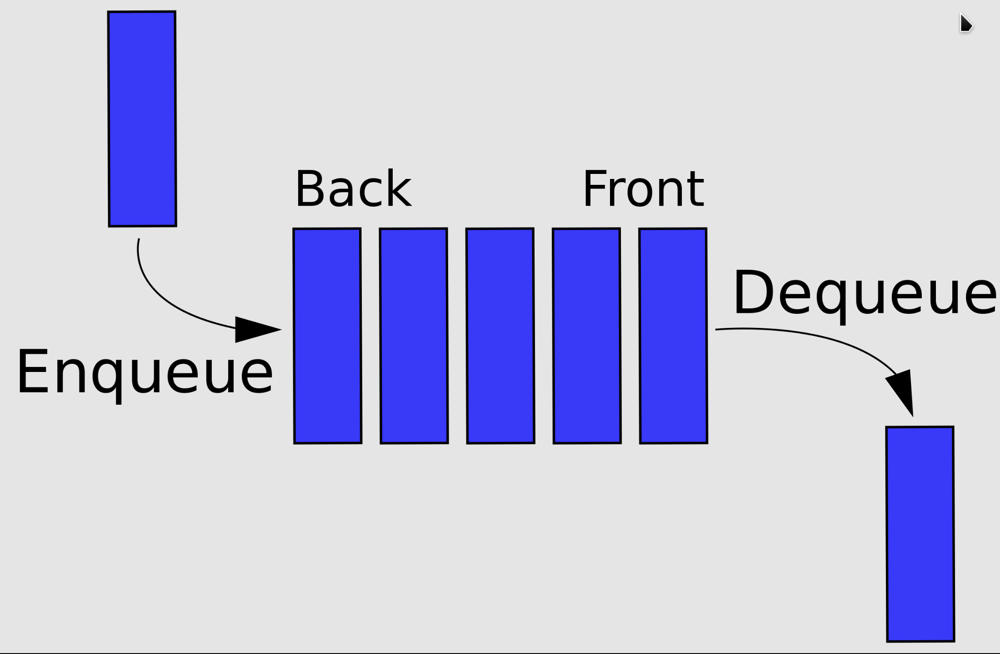

## 栈/队列
### 栈
`栈`是计算机科学中的一种抽象数据类型，只允许在有序的线性数据集合的一端（称为栈顶，top）进行加入数据（**push**）和移除数据（**pop**）。因而按照后进先出（**LIFO**, Last In First Out）的原理运作，栈常用一维数组或链表来实现。常与另一种有序的线性数据集合**队列**相提并论。

**栈**使用两种基本操作：
- 入栈：将元素放入栈的顶端。
- 出栈：将栈顶端的元素移除。

栈的基本特点：
- 先入后出，后入先出。
- 除头尾节点之外，每个元素有一个前驱，一个后继。

### 队列
`队列`是计算机科学中的一种抽象数据类型，是先进先出（**FIFO**, First-In-First-Out）的线性表。在具体应用中通常用链表或者数组来实现。队列只允许在后端/尾部（称为rear/back/tail）进行插入操作，在前端/头部（称为front/head）进行删除操作。

队列的操作方式和栈类似，唯一的区别在于队列*只允许新数据在后端进行添加*。

## 习题
[232: 用栈实现队列](232_implement_queue_using_stacks.md)
[225: 用队列实现栈](225_implement_stack_using_queues.md)
[20: 有效的括号](20_valid_parentheses.md)
[1047: 删除字符串中的所有相邻重复项](1047_remove_all_adjacent_duplicates_in_string.md)
[150: 逆波兰表达式求值](150_evaluate_reverse_polish_notation.md)
[239: 滑动窗口最大值](239_sliding_window_maximum.md)
[347: 前K个高频元素]

## 总结