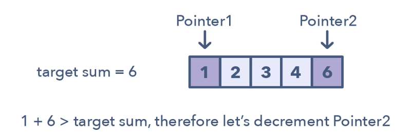
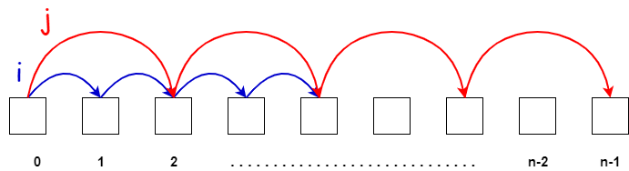

## 双指针
双指针技术是一种以受控的方式遍历数据集（通常是数组或列表）的技术。它包括两个指针，一个指向数据集的开头，另一个指向数据集的结尾，并根据特定条件将它们相互移动。这种技术通常用于解决涉及在数据集中搜索特定条件或模式的问题，或者需要对数据集中的不同元素进行比较的问题。

双指针技术主要用于解决具有线性时间复杂度的问题，与暴力解法相比，它可以大大提高性能。使用该技术解决的一些常见问题包括：
- 查找一组数据中的最大/最小值。
- 计算特定元素的出现次数。
- 查找没有重复字符的最长子串。
- 查找大小为`k`的子数组的最大和。
  
总的来说，双指针技术是解决特定类型问题的有用方法，这些问题涉及以可控方式迭代数据集，如模式匹配、数据分析和统计。它可以对数据集进行高效、可控的迭代，从而提高性能和结果的准确性。

## 习题
### 移除元素
[27: 移除元素](../array/27_remove_element.md)
[26: 删除有序数组中的重复项](../array/26_remove_duplicates_from_sorted_array.md)
[283: 移动零](../array/283_move_zeroes.md)
[844: 比较含退格的字符串](../array/844_backspace_string_compare.md)
[977: 有序数组的平方](../array/977_squares_of_a_sorted_array.md)

### 反转字符串
[344: 反转字符串](../string/344_reverse_string.md)

### 替换数字
[卡码网54: 替换数字](../string/kamacoder_54_replace_numbers.md)

### 翻转字符串里的单词
[151: 翻转字符串里的单词](../string/151_reverse_words_in_a_string.md)

### 反转链表
[206: 反转链表](../linkedlist/206_reverse_linked_list.md)

### 删除链表的倒数第N个节点
[19: 删除链表的倒数第N个节点](../linkedlist/19_remove_nth_node_from_end_of_list.md)

### 链表相交
[160: 链表相交](../linkedlist/160_intersection_of_two_linked_lists.md)

### 环形链表
[141: 环形链表](../linkedlist/141_linked_list_cycle.md)
[142: 环形链表II](../linkedlist/142_linked_list_cycle_II.md)

### 三数之和
[15: 三数之和](../hashtable/15_three_sum.md)
[16: 最接近的三数之和](../hashtable/16_three_sum_closest.md)

### 四数之和
[18: 四数之和](../hashtable/18_four_sum.md)

## 总结